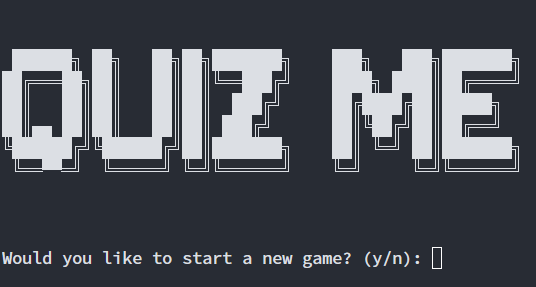
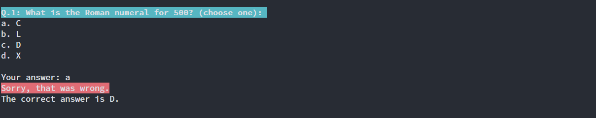
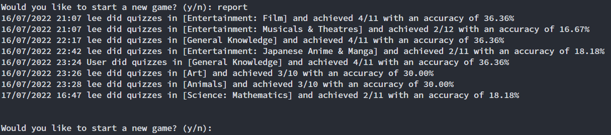

# QuizMe Python Console Application

This application is build around the **Open Trivia Database API** (https://opentdb.com/). <br>
All assets and source code are hosted at https://github.com/taoli24/quizme.

## Purpose

The purpose of this application is to  help user gain extra knowledge and getting better at quizzes.

## Code style

* snake_casing for function names and variable names
* All capital letters for constants
* Pacal casing for class names
* leading _ for private methods and variables
* Imports should be on separate lines
* Surrounding top level function and classes with two blank lines
* Use 4 spaces per indentation level

Guido, R. Barry, W. Nick, C. (2013, August 01). PEP 8 – Style Guide for Python Code. Retrieved 2022, Jul 17, from https://peps.python.org/pep-0008/

## Main features of this application

1. **The application utilise Open trivia database API for generating questions**
    * Quiz questions are retrieved from API from user chosen categories
    * User can choose quizzes from 24 different categories
    * User can choose number of questions (10-50)
    * There are two type of questions(true/false and multiple choice questions)

2. **This application uses OOP approach**
    * Questions class form the basis of a question object
    * MultipleChoiceQuestion class inherit from Question class and has one extra property - answer_list
    * Main logic are controlled by QuizControl class which serves a brain of the quiz app.
   
3. **All user inputs are validated before feed into the program**
    * This means user input are controlled in the way that only acceptable user input will be used in this application to prevent errors

4. **Different type of control logic are used in this application, this includes:**
    * if, else statements
    * for and while loops
    * recursive functions

5. **Error handling**
    * User input are handled in try except block
    * Network module has custom decorator function which helps handle errors that may occur when communicate with the API server, this also keeps code dry

## Class diagrams


## Implementation plan
[Link to trello](https://trello.com/b/wWPQgYuj/quizme-project-board)


## Help document

### Dependencies which are required for this application:

```
ansicon==1.89.0
blessed==1.19.1
certifi==2022.6.15
charset-normalizer==2.1.0
colorama==0.4.5
docopt==0.6.2
idna==3.3
jinxed==1.2.0
prefixed==0.3.2
requests==2.28.1
six==1.16.0
tqdm==4.64.0
urllib3==1.26.10
wcwidth==0.2.5
yarg==0.1.9
```

The dependency list is also stored in **[requirements.txt](https://github.com/taoli24/quizme/blob/main/requirements.txt)**

### To run this on your computer:

1. **clone all assets and source to your local machine**
```shell
$ git clone https://github.com/taoli24/quizme.git
```
2. **Run pip install to install required packages**
```shell
$ pip install -r requirements.txt
```
3. **Run the following command to start the application**<br>

* **On linux or MacOs**
```shell
$ chmod +x run_quiz.sh
$ ./run_quiz.sh
```

* **On Windows**
```shell
$ python3 main.py
```

### To view logs of past quiz results
```shell
$ ./run_quiz.sh --log
```

### To display help file
```shell
$ ./run_quiz.sh --help
```

### Screenshots of gameplay:







